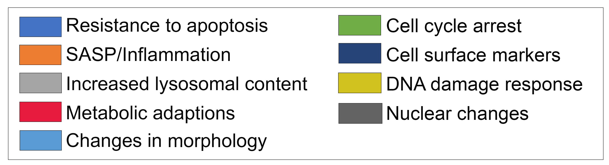

# Biomarkers

Interactive graph visualization of [senescence
biomarkers](graphviz.html?sheet=1ScnrvcwUpwN_ikklZnd8HSqvgm4GRRTCVxbkyU_j2iw).
This network representation of the supplemental data shows each organ node as a text string, each colored node as a
biomarker (with hover revealing the human gene symbol), node colors representing the hallmarks according to the legend, node sizes
representing the number of supporting papers in PubMed (with clicking on each node automatically revealing the papers in
PubMed search), and node edges showing in which organ(s) each biomarker is represented (with green edges from mouse
only, pink edges from human only, and gray edges for both). The interactive website has pan, zoom, individual draggable
organs and nodes, and clicking on nodes searches in PubMed, built in Javascript utilizing the Data Driven Documents (
D3.org) libraries reading directly from the Google Sheet containing the [supplemental
data](https://docs.google.com/spreadsheets/d/1ScnrvcwUpwN_ikklZnd8HSqvgm4GRRTCVxbkyU_j2iw/edit#gid=0).

