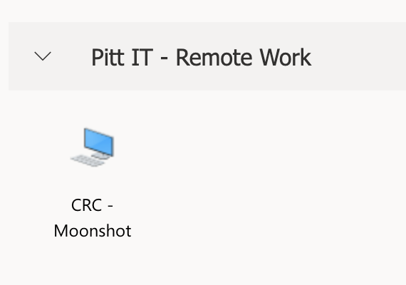
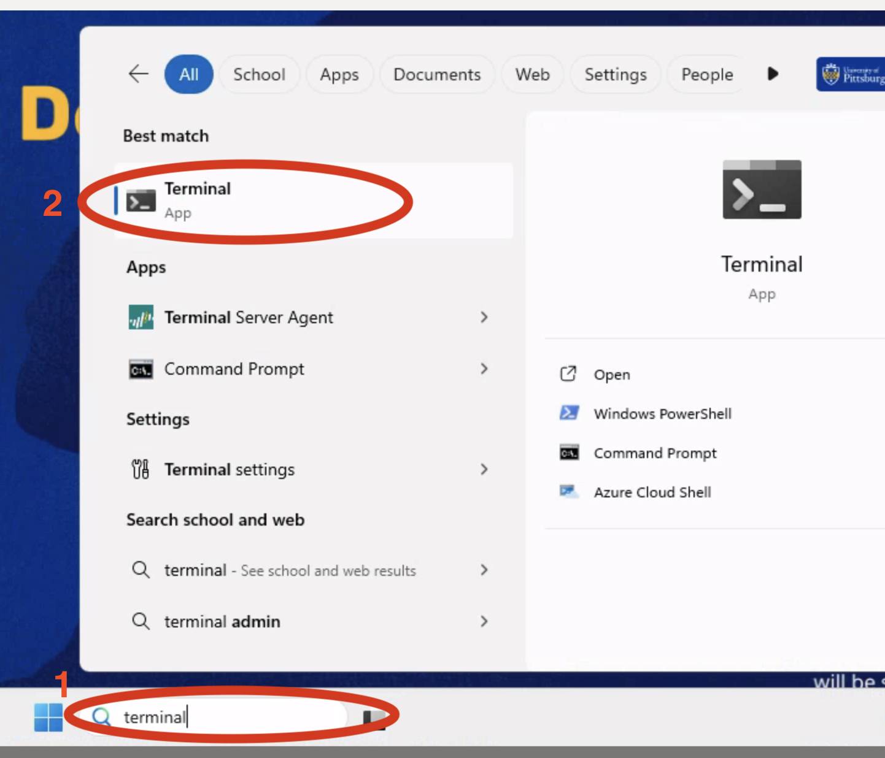
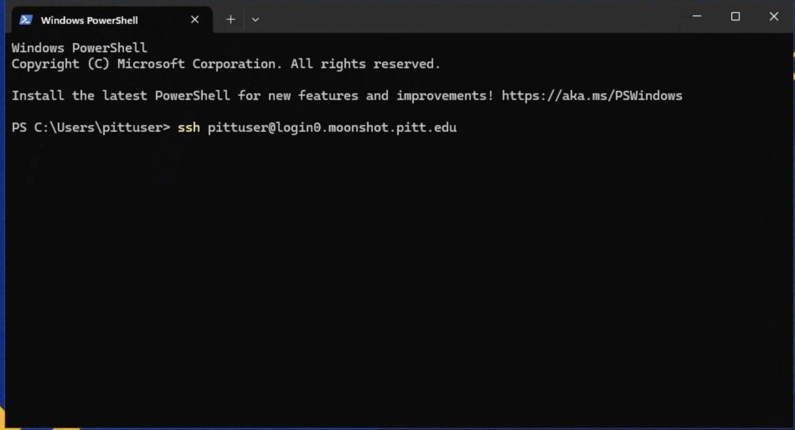

# Dell Innovation "Moonshot" Hub Access

The Dell Innovation Hub is a small cluster used by SenNet for compute and data storage. To gain Linux command line access (via ssh) to the Hub you'll need to gain access to the private network using the GlobalProtect client for remote access into the private network. You will need a Pitt account to log into GlobalProtect.  These instructions are specifically for users coming in with a sponsored account (non-Pitt employee), but will work similarly for a user with a standard Pitt account. If you don't have a Pitt sponsored account, or you have a Pitt account, but haven't been granted access to the Hub see the [Requesting Hub Access](request-hub-access.html) page.

This document describes how to gain access to the private network where the Hub sits by using the GlobalProtect security client.

<h2 id="installing-global-protect-to-use-with-pitt-sponsored-accounts">Installing GlobalProtect to use with Pitt sponsored accounts</h2>
### Introduction

Global Protect is the client required to access resources secured behind Pitt's firewall. Several use cases require the use of Global Protect for users external to Pitt who have a valid sponsored Pitt account. Install using the instructions included here for Windows, Mac or Linux.  After installation see the details below the installation instructions to check access to internal Pitt resources. If Global Protect won't work for you, there are further instructions on how to access the internal resources by remoting to an internal virtual desktop.

### Requirements

GlobalProtect requires certain system requirements in order to pass a system "Health Check" before connections will be allowed to pass into the protected zones.  These requirements are listed below (click to expand) make sure your system can pass these checks before installing GlobalProtect.

**IMPORTANT** After GlobalProtect has been installed and enabled try to make an ssh connection to login0.moonshot.pitt.edu, if the connection is successful (doesn't hang) and you are prompted to log in then GlobalProtect is working and you have passed all Health Checks, though, you may not be able to log in yet because access to the systems may not have been granted yet.  If you are unable to use GlobalProtect, see the [Using a Virtual Desktop To Connect](#virt-desktop) section below.

GlobalProtect Health Check Requirements for a Pitt Sponsored Account (click to expand)

<h3 id="GP-HIPCheck-Requirements">GlobalProtect Health Check Requirements:</h3>

  - Disk Encryption must be enabled on your computer
  - Your computer must be one of the following operating systems:
      - Linux CentOS 8.x
      - Linux CentOS 7.x
      - Linux RHEL 8.x
      - Linux RHEL 9.x
      - Linux Ubuntu 20.x
      - Linux Ubuntu 22.x
      - Linux Ubuntu 16.04
      - Linux Ubuntu 18.04
      - Windows 10 Education
      - Windows 10 Enterprise
      - Windows 10 Pro
      - Windows 10 Home
      - Windows 11
      - Mac OS X 13.x
      - Mac OS X 14.x
      - Mac OS X 15.x

### Installing GlobalProtect
To install GlobalProtect, using your Pitt sponsored account log into <a href="https://software.pitt.edu" target="_blank" rel="noopener noreferrer">Pitt Software Repository</a>.  The <a href="https://software.pitt.edu/Home/SoftwareSearch?SearchText=GlobalProtect&PlatformId=0" target="_blank" rel="noopener noreferrer">search for GlobalProtect</a> and open the section matching your OS for the installation download and installation instructions.  GlobalProtect specific download instructions by OS are available:
  - <a href="https://docs.paloaltonetworks.com/globalprotect/6-0/globalprotect-app-user-guide/globalprotect-app-for-windows/download-and-install-the-globalprotect-app-for-windows#idf9d1968d-51fb-463b-8923-4c785cee5f18" target="_blank" rel="noopener noreferrer">Microsoft Windows</a>
  - <a href="https://docs.paloaltonetworks.com/globalprotect/6-0/globalprotect-app-user-guide/globalprotect-app-for-mac/download-and-install-the-globalprotect-app-for-mac" target="_blank" rel="noopener noreferrer">Apple macOS</a>
  - <a href="https://docs.paloaltonetworks.com/globalprotect/6-0/globalprotect-app-user-guide/globalprotect-app-for-linux/download-and-install-the-globalprotect-app-for-linux" target="_blank" rel="noopener noreferrer">Linux</a>

GlobalProtect requires certain system requirements in order to pass a system "Health Check" before connections will be allowed to pass into the protected zones.  These requirements for non-Pitt, sponsored logins are listed just below, make sure your system can pass these checks before installing GlobalProtect.  After GlobalProtect has been installed and enabled try to make an ssh connection to login0.moonshot.pitt.edu, if the connection is successful (doesn't hang) and you are prompted to log in then GlobalProtect is working and you have passed all Health Checks, though, you may not be able to log in yet because access to the systems may not have been granted yet.  If you are unable to use GlobalProtect, see the [Using a Virtual Desktop To Connect]() section below.

### Enabling and Testing GlobalProtect

 1. After installation, run GlobalProtect, enter `portal-palo.pitt.edu` as the portal endpoint and click connect: 

 2. Login with your Pitt username and password: 

 3. Enter the two-factor authentication method- depending on how you set up the two-factor authentication for your Pitt account enter: 
    1 -to push to Duo 
    2 -to get a phone call 
    3 -to get a text message 

#### Testing GlobalProtect

To test GlobalProtect, after it has been successfully installed and enabled, open a shell/terminal on your computer and try to make an ssh connection to `yourpittusername@login0.moonshot.pitt.edu`. If you see the login prompt, everything is working, though, you may not be able to log in because full access hasn't yet been granted. You will be notified once access has been granted.  If the ssh connection hangs and/or times out GlobalProtect is not working and likely hasn't passed one of the Health Check requirements listed above.  

  
<h2 id="virt-desktop" style="margin-bottom: 20px;">
Virtual Desktop Access
</h2>

In the event that GlobalProtect won't work for you, you can use a browser based virtual desktop environment to access the Hub.  Start by connecting your browser to <a href="https://pi.tt/vlab" target="_blank" rel="noopener noreferrer">https://pi.tt/vlab</a>. After connecting to the Virtual Environment in your browser:

  1. Click the "CRC - Moonshot" icon: 
 
  2. Start a terminal, by 1- searching for "Terminal" in the Windows Search Bar, then 2- click the "Terminal" application: 
 
  3. In the terminal ssh to `yourpittusername@login0.moonshot.pitt.edu`: 
  