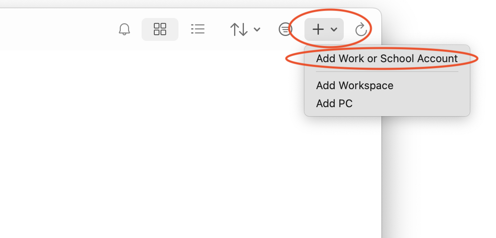
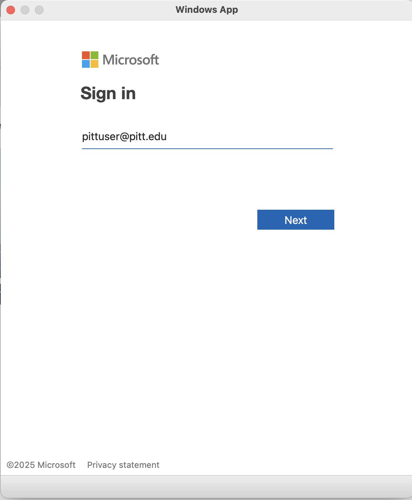
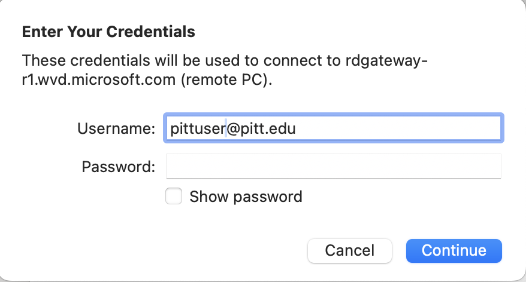

# Dell Innovation "Moonshot" Hub Access

The Dell Innovation Hub is a small cluster used by SenNet for compute and data storage. To gain Linux command line access (via ssh) to the Hub, you'll first need to gain access to the private network using the GlobalProtect client for remote access into the private network. Additionally, you will need a Pitt account to log into GlobalProtect. The following instructions are specifically for users with a sponsored account (non-Pitt employees), but will work similarly for users with a standard Pitt account. If you don't have a Pitt sponsored account, or you have a Pitt account, but haven't been granted access to the Hub see the [Requesting Hub Access](request-hub-access.html) page.

This document describes how to gain access to the private network where the Hub sits by using the GlobalProtect security client.

<h2 id="installing-global-protect-to-use-with-pitt-sponsored-accounts">Installing GlobalProtect to use with Pitt sponsored accounts</h2>
### Introduction

Global Protect is the client required to access resources secured behind Pitt's firewall. Several use cases require the use of Global Protect for users external to Pitt who have a valid sponsored Pitt account. Install using the instructions included here for Windows, Mac or Linux.  After installation see the details below the installation instructions to check access to internal Pitt resources. If Global Protect won't work for you, there are further instructions on how to access the internal resources by remoting to an internal virtual desktop.

### Requirements

GlobalProtect requires specific system requirements in order to pass a system "Health Check" before connections will be allowed to pass into the protected zones.  These requirements are listed below (click to expand). Verify your system can pass these checks before installing GlobalProtect.

**IMPORTANT** Once GlobalProtect is installed and enabled, make an ssh connection to `login0.moonshot.pitt.edu`, if the connection is successful (doesn't hang) and you are prompted to log in, GlobalProtect is working and you have passed all Health Checks. However, you may not be able to log in if access to the systems has not been granted yet.  If you are unable to use GlobalProtect, see the [Using a Virtual Desktop To Connect](#virt-desktop) section below.

GlobalProtect Health Check Requirements for a Pitt Sponsored Account (click to expand)

<h3 id="GP-HIPCheck-Requirements">GlobalProtect Health Check Requirements:</h3>

  - Disk Encryption must be enabled on your computer
  - Your computer must be one of the following operating systems:
      - Linux CentOS 8.x
      - Linux CentOS 7.x
      - Linux RHEL 8.x
      - Linux RHEL 9.x
      - Linux Ubuntu 20.x
      - Linux Ubuntu 22.x
      - Linux Ubuntu 16.04
      - Linux Ubuntu 18.04
      - Windows 10 Education
      - Windows 10 Enterprise
      - Windows 10 Pro
      - Windows 10 Home
      - Windows 11
      - Mac OS X 13.x
      - Mac OS X 14.x
      - Mac OS X 15.x

### Installing GlobalProtect
To install GlobalProtect, use your Pitt sponsored account to log into <a href="https://software.pitt.edu" target="_blank" rel="noopener noreferrer">Pitt Software Repository</a>. Search for GlobalProtect and open the section matching your OS to display download and installation instructions. GlobalProtect specific download instructions by OS are available:
  - <a href="https://docs.paloaltonetworks.com/globalprotect/6-0/globalprotect-app-user-guide/globalprotect-app-for-windows/download-and-install-the-globalprotect-app-for-windows#idf9d1968d-51fb-463b-8923-4c785cee5f18" target="_blank" rel="noopener noreferrer">Microsoft Windows</a>
  - <a href="https://docs.paloaltonetworks.com/globalprotect/6-0/globalprotect-app-user-guide/globalprotect-app-for-mac/download-and-install-the-globalprotect-app-for-mac" target="_blank" rel="noopener noreferrer">Apple macOS</a>
  - <a href="https://docs.paloaltonetworks.com/globalprotect/6-0/globalprotect-app-user-guide/globalprotect-app-for-linux/download-and-install-the-globalprotect-app-for-linux" target="_blank" rel="noopener noreferrer">Linux</a>

### Enabling and Testing GlobalProtect

 1. After installation, run GlobalProtect, enter `portal-palo.pitt.edu` as the portal endpoint and click connect: 
  
 2. Login with your Pitt username and password: 
  
 3. Enter the two-factor authentication method- depending on how you set up the two-factor authentication for your Pitt account, enter: 
    1 -to push to Duo 
    2 -to get a phone call 
    3 -to get a text message 
  

#### Testing GlobalProtect

To test GlobalProtect after it has been successfully installed and enabled, open a shell/terminal on your computer and try to make an ssh connection to `yourpittusername@login0.moonshot.pitt.edu`. If you see the login prompt, everything is working, however, you will not be able to log in if full accss hasn't yet been granted. You will be notified once access has been granted.  If the ssh connection hangs or times out GlobalProtect is not working and likely hasn't passed one of the Health Check requirements listed above.  

  
<h2 id="virt-desktop" style="margin-bottom: 20px;">
Virtual Desktop Access
</h2>

In the event that GlobalProtect won't work for you, you can use a browser based virtual desktop environment to access the Hub.  Start by connecting your browser to <a href="https://pi.tt/vlab" target="_blank" rel="noopener noreferrer">https://pi.tt/vlab</a>. After connecting to the Virtual Environment in your browser:

### Install Microsoft "Windows App"
Microsoft Windows App is a remote desktop client that will connect you to a remotely running Windows machine with access to the Moonshot login node. Start by installing and configuring Windows app on your Windows or Mac system (choose one below)

macOS: Install and Configure Windows App (click to expand)

<h4 id="windows-app-mac">Install and Configure Windows App for macOS:</h4>
  1. Start by installing the Windows App for the Apple macOS: <a href="https://apps.apple.com/us/app/windows-app/id1295203466?mt=12" target="_blank">Mac Install</a> 
  2. After installing launch Windows App, click the "+" dropdown in the upper right corner and select "Add Work or School Account": 
  
  3. Sign in using your Pitt credentials (this should take you through two-factor authentication): 
  
  4. After successful authentication, the "CRC - MOON Shot" device will be added to the list of devices on your list of devices.

Windows: Install and Configure Windows App (click to expand)

  1. Start by installing the Windows App: <a href="https://apps.microsoft.com/detail/9n1f85v9t8bn?hl=en-US&gl=US" target="_blank">Windows Install</a> 
  2. After installing launch the Windows App, open Settings, select Apps then click "Add a workplace or school account": 
  
  3. Sign in using your Pitt credentials (this should take you through two-factor authentication): 
  
  4. After successful authentication, the "CRC - MOON Shot" device will be added to the list of devices on your list of devices.

### Launching the Virtual Desktop and connecting to the login node

  1. Under the newly added workspace a "CRC - Moonshot" device connection will be shown, choose that option: 
  
  2. The Virtual Desktop will be created and launched.  You will see a notification box which will announce that it is: &nbsp;&nbsp;&nbsp;
    - "Initiating Connection" &nbsp;&nbsp;&nbsp;
    - "Starting remote PC" &nbsp;&nbsp;&nbsp;
    - "Waiting for remote PC" &nbsp;&nbsp;&nbsp;
    - "Configuring Gateway" &nbsp;&nbsp;&nbsp;
    - "Starting remote PC" &nbsp;&nbsp;&nbsp;
    - "Waiting for remote PC" &nbsp;
    **Be patient, this process may take several minutes** 
  
  3. You will be asked to login.  Use your Pitt credentials. 
  
  6. The remote virtual desktop will show a Windows desktop. Start a terminal by searching for "Terminal" in the Windows Search Bar, then clicking the "Terminal" application: 
   
  7. In the terminal, ssh to `yourpittusername@login0.moonshot.pitt.edu`: 
  