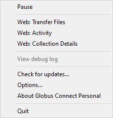
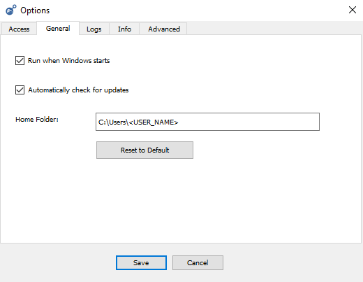
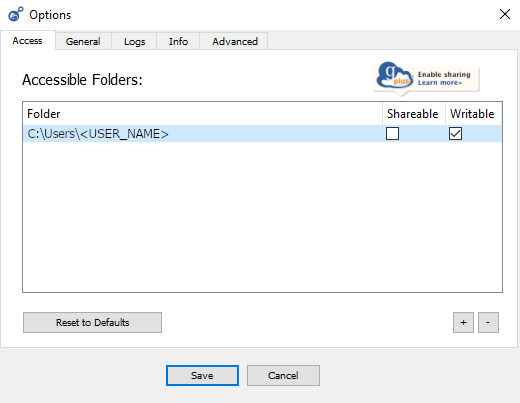

# Setting Up Globus Connect Personal on Windows

Globus Connect Personal (GCP) does not set the user home directory as the default download location. As a result, it is recommended to change the download location to the user home directory to avoid difficulty finding the downloaded files. After following the steps below, files and directories will be downloaded relative to the user home directory. For example:
```bash
# If --destination argument is specified in transfer command
C:\Users\<USER_NAME>\PATH\SPECIFIED\IN\DESTINATION\ARGUMENT

# If no --destination argument is specified in transfer command
C:\Users\<USER_NAME>\sennet-downloads
```

## Instructions
1. Ensure GCP is running. You can determine this by checking if a "g" icon is located in the bottom right of the screen.<br>
{: .clt-img.w-fixed }
2. Right-click on the "g" icon and choose the "Options..." button to open the GCP options.<br>
{: .clt-img.w-fixed }
3. In the "General" tab, change the "Home Folder" to the user home directory. For example, `C:\Users\<USER_NAME>`.<br>
{: .clt-img.w-fixed}
4. In the "Access" tab, click the "+" button in the bottom right and add the user home directory from step 3. Make sure the "Writable" checkbox is checked next to the newly created entry.<br>
{: .clt-img.w-fixed } 