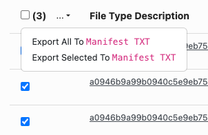

# SenNet Command-Line Transfer (CLT)

The [SenNet Command-Line Transfer (CLT)](https://pypi.org/project/atlas-consortia-clt/) tool streamlines the download of individual files and directories from multiple datasets and uploads. Files and directories are specified in a manifest file and given to the CLT.

## Installation

The CLT uses the [Globus Connect Personal](https://www.globus.org/globus-connect-personal) (GCP) application to download the specified files and directories to your computer. GCP and the CLT require a SenNet account. This account is the same account used to log in to the SenNet Data Sharing Portal. Windows users should follow [additional instructions](gcp-windows) to correctly setup GCP.

The CLT requires Python 3.9 or above.

### pip

Install the CLT globally using pip:
```bash
pip install atlas-consortia-clt
```

### pip with a virtual environment

Installing in a virtual environment keeps the CLT and its dependencies isolated from other Python projects.

**macOS/Linux:**
```bash
python3 -m venv clt-env # creates virtual environment named clt-env in the current directory
source clt-env/bin/activate # activates the virtual environment
pip install atlas-consortia-clt
```

**Windows:**
```bash
python -m venv clt-env # creates virtual environment named clt-env in the current directory
clt-env\Scripts\activate # activates the virtual environment
pip install atlas-consortia-clt
```

To use the CLT in the future, activate the virtual environment first:

**macOS/Linux:**
```bash
source clt-env/bin/activate
```

**Windows:**
```bash
clt-env\Scripts\activate
```

To deactivate the virtual environment, run the following command on any platform:
```bash
deactivate
```

### pipx

[pipx](https://pipx.pypa.io) installs the CLT in its own isolated environment and automatically exposes the `sennet-clt` commands on your `PATH`, without affecting other Python packages.

Install pipx if you don't have it. Check the [pipx documentation](https://pipx.pypa.io/stable/#install-pipx) for detailed installation instructions.

Then install the CLT. The CLT relies on the `globus-cli` package and must also be installed via pipx.
```bash
pipx install atlas-consortia-clt globus-cli
```

To upgrade:
```bash
pipx upgrade atlas-consortia-clt globus-cli
```

## Manifest File

Files and directories of interest are specified in a manifest file. A manifest is a text file that contains the dataset id and the path to the dataset, separated by a space. Multiple files or directories can be specified by placing each on a separate line. A directory can be specified by ending the path with a slash `/`. An optional header can be specified at the top of the file. Text after the path will be ignored and can be used for comments.

### Example

```
dataset_id file_or_dir_specifier    #optional header line is ignored
SNT123.ABCD.456 /metadata.tsv       #download the metadata.tsv file for dataset SNT123.ABCD.456
SNT345.ABCD.456 /                   #download all files in the dataset SNT345.ABCD.456
SNT378.HDGT.837 /extras             #download the extras directory from dataset SNT378.HDGT.837
```

### Creating from Data Sharing Portal

Manifest files can be created from the home page of
the [Data Sharing Portal](https://data.sennetconsortium.org/search?size=n_10000_n&filters%5B0%5D%5Bfield%5D=entity_type&filters%5B0%5D%5Bvalues%5D%5B0%5D=Dataset&filters%5B0%5D%5Btype%5D=any&sort%5B0%5D%5Bfield%5D=last_modified_timestamp&sort%5B0%5D%5Bdirection%5D=desc)
when `Dataset` is selected as a filter. Select the checkboxes next to the datasets of interest and then click the download actions button
at the top left of the table.<br>
{: .clt-img.w-fixed }

## Usage

Usage documentation can also be found by running the following command:
```bash
sennet-clt -h
```

### Login

A one-time login is required for any download session. For non-public data, you must log in with your SenNet account. For publicly available data, you can log in with any account accepted by the login form (Google and ORCID). Log in can be initiated using the following command:

```bash
sennet-clt login
```

By default, login will automatically open a browser window to complete authentication. If you are in a headless environment (e.g. a remote server without a browser), use the `--no-browser` flag. This will display a URL in the terminal that you can copy and open in a browser on another device to complete the login:

```bash
sennet-clt login --no-browser
```

### Logout

Logout can be used to log out the current user.
```bash
sennet-clt logout
```

### Transfer

A data transfer and download can be initiated using the transfer command and a manifest file. You must be logged in to use the transfer command.
```bash
sennet-clt transfer <PATH/TO/MANIFEST/FILE> 
```
An optional destination argument can be specified. The destination is the directory on the user's computer where data will be downloaded. The directory will be created if it doesn't exist. The destination argument is relative to the user's home directory (~). For example, `--destination Desktop/sennet-data` corresponds to an absolute path of `~/Desktop/sennet-data`. The default destination directory is `~/sennet-downloads`.
```bash
sennet-clt transfer <PATH/TO/MANIFEST/FILE> --destination <PATH/TO/DESTINATION/DIRECTORY>
```
An optional `--from-protected-space` flag can be specified to download protected data belonging to a published protected `Dataset`. By default, the CLT will download public data only. The user must have access to the protected data in order for the transfer to be successful.
```bash
sennet-clt transfer <PATH/TO/MANIFEST/FILE> --from-protected-space
```

### Whoami

Whoami can be used to display the information of the currently logged in user.
```bash
sennet-clt whoami
```