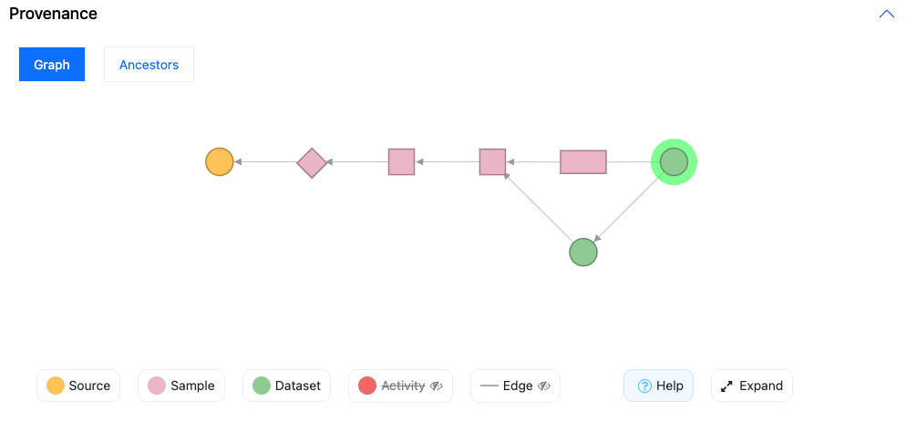

# Provenance UI

The Provenance UI allows for building interactive "graphs hierarchy" of a particular entity type and its ancestors and descendants.
  
Usage details of the graph is fully documented within its UI by clicking the Help button. 
Full documentation for developers is available at its [GitHub](https://github.com/sennetconsortium/provenance-ui) repo.