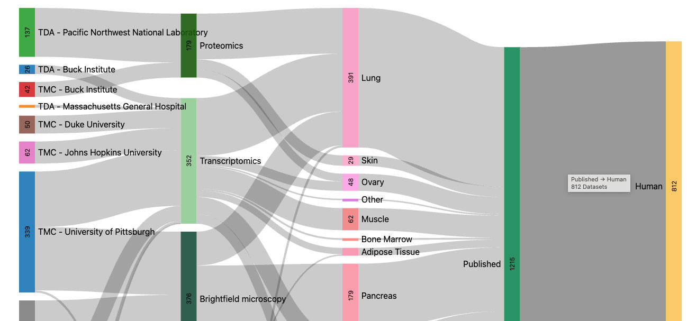

# Atlas Consortia Sankey (XAC Sankey)

This library generates a Sankey diagram that provides comprehensive information about datasets registered
within the consortium. The visualization features interactive components that enable the user to rearrange the graphic
and click on nodes or labels to be redirected to the SenNet Data Sharing Portal with pre-selected filters. Hovering over
specific elements will highlight relationships and display the count of datasets that fall within those relationships.

The `xac-sankey` is available for usage at its [GitHub Repo](https://github.com/x-atlas-consortia/data-sankey). The
package is fully configurable, enabling users to set endpoints, column names, colors, themes, events callbacks, and
more. The package currently has two adapters available for seamless integration in SenNet and HuBMAP projects. These
adapters also provide usage examples for developers.

A live version of the Sankey diagram is available on the [data overview page](/data-sankey).
