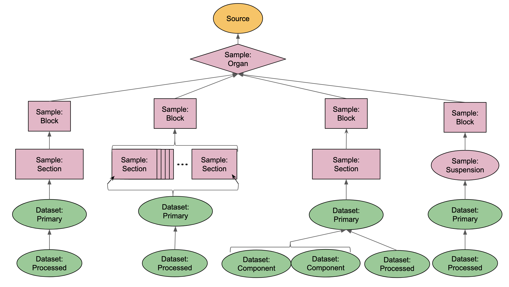

# SenNet Provenance Graph

## Overview

SenNet metadata which describes tissue donors, organs, tissue samples and datasets is stored in a hierarchical graph to
track the provenance of any data registered in SenNet back through any other data, tissue samples, organs and sources
from which each is derived.

## Description

The provenance graph, an example of which for the data derived from a single tissue donor is shown below, contains three
main types of graph node or entity types: Sources, Samples and Datasets. Each of these main entity types contain
sub-types:

- Source (Human or Mouse)
    - Organ Donor (findable by the existence of the field <code>Source.metadata.organ_donor_data</code>)
    - Living/Surgical Donor (findable by the existence of the field <code>Source.metadata.living_donor_data</code>)
- Sample
    - Organ (findable by matching <code>Sample.sample_category == "Organ"</code>)
    - Tissue Block (findable by matching <code>Sample.sample_category == "Block"</code>)
    - Tissue Section (findable by matching <code>Sample.sample_category == "Section"</code>)
    - Tissue Suspension (findable by matching <code>Sample.sample_category == "Suspension"</code>)
- Dataset
    - Primary Data: data registered and uploaded by SenNet data providers, this data must have a direct parent entity in
      the provenance graph of type Sample. (findable by matching <code>Dataset.creation_action == "Create Dataset
      Activity"</code>)
    - SenNet Processed Data: Data created by one of the central processing pipelines. This data must have a
      direct parent entity in the provenance graph of type Dataset, i.e., data derived by processing other data. (
      findable by matching <code>Dataset.creation_action == "Central Process"</code>)
    - Component Data: Separate datasets that represent the components that make up a Multi-Assay Primary Data dataset.
      For example a 10X Multiome Multi-Assay primary dataset is composed of both RNAseq and ATACseq assays. (findable by
      matching <code>Dataset.creation_action == "Multi-Assay Split"</code>)
    - Lab/Provider Processed Data: Data created by one of the SenNet data provider labs by processing primary data. This
      data must have a direct parent entity in the provenance graph of type Dataset. (findable by matching
      <code>Dataset.creation_action == "Lab Processed"</code>)

