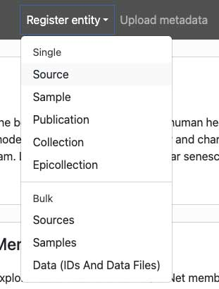
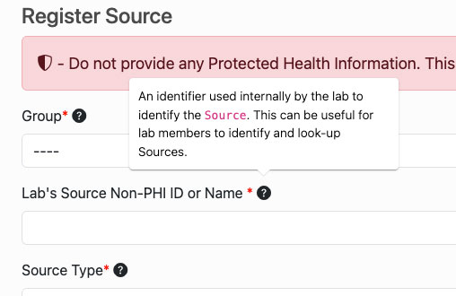

# Entity Registration Schemas & Guidelines
From the [Data Sharing Portal](https://data.sennetconsortium.org/), users have the ability to register entities individually 
and in bulk.

More information regarding the structure of the SenNet provenance can be found [here](../provenance).

## New to the Data Submission process?
Visit this page to learn more: [Getting Started](../libraries/ingest-validation-tools/upload-guidelines/getting-started)

## Available bulk registration schemas
- [Sources](/registration/bulk-registration/source.html)
- [Samples](/registration/bulk-registration/sample.html) 
- [Data Upload](/data-submission/Section8) 

## Available Metadata and Directory Schemas

Uploading metadata in bulk can be done via the [Data Sharing Portal](https://data.sennetconsortium.org/edit/bulk/metadata).

### Source
- [Source - Murine](/registration/schemas/source-murine)

### Sample
- [Sample - Block](/registration/schemas/sample-block/)
- [Sample - Section](/registration/schemas/sample-section/)
- [Sample - Suspension](/registration/schemas/sample-suspension/)

**Read More:** [HuBMAP Schemas](https://docs.hubmapconsortium.org/metadata)

For assistance with validating your metadata files please visit the [CEDAR Metadata Spreadsheet Validator](https://metadatavalidator.metadatacenter.org/).

## Registration Interfaces
### [Data Sharing Portal](https://data.sennetconsortium.org/)
Users can use the online graphical user interface to register entities. The process is as follows:
- Navigate to [Data Sharing Portal](https://data.sennetconsortium.org/) and then click `Login` from the top right.
- Select the `Register entity` drop down menu link <app-modal data-title="Click the Register entity menu link" data-body=""><i role='button' aria-label='View modal for Register entity menu link' class='js-modal link-primary fa fa-picture-o'>&nbsp;</i> </app-modal>
- Choose either to register a single entity or do bulk registration.
The single form interface fields are well labeled. The question mark  icons on the right of field labels provide tips on what the expected value should be <app-modal data-title="Form elements" data-body=""><i role='button' aria-label='View modal for Form elements' class='js-modal link-primary fa fa-picture-o'>&nbsp;</i> </app-modal>. Red asteriks * denote required fields.
The bulk registration interface is presented in a form of a wizard. Use the associated `example.tsv` field on the respective form as a guide for filling out the data to be uploaded. 

### [API](/apis/entity-api/#registering-entities)
Users may also utilize the [API to register entities](/apis/entity-api/#registering-entities). Each request to the API must be authorized. For a quick guide, see the [APIs Getting Started](/apis/getting-started) page.
